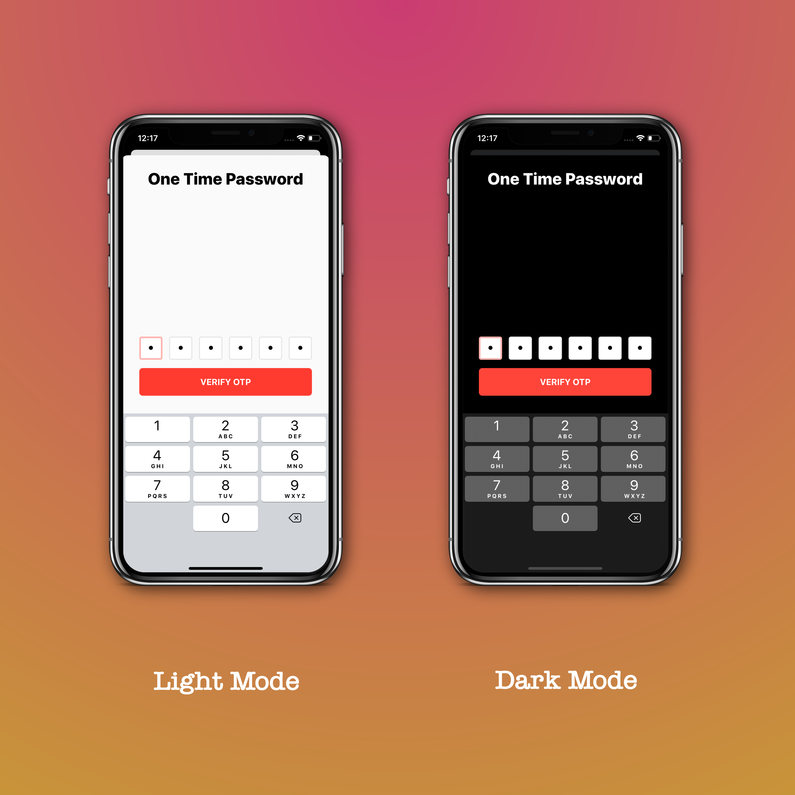

# BJOTPViewController


<a href="https://github.com/BadhanGanesh/BJOTPViewController/blob/master/LICENSE" target="_blank">
    
</a>

<a href="https://stackoverflow.com/users/5912335/badhanganesh?tab=profile" target="_blank">
    
</a>
<a href="https://twitter.com/intent/follow?screen_name=badhanganesh" target="_blank">
    
</a>

&nbsp;

A very simple and neat-looking view controller that lets you type in OTP's quick and easy.

This is intended to be a drag and drop view controller that gets the work done quickly, in and out, that's it. No fancy customizations, no cluttering the screen with tons of UI elements and crazy colors. You'll be good to go with the default settings.


## Supports

✅ iOS 9.0+

✅ Swift 4.0+

✅ iOS | iPadOS

✅ Portrait | Landscape


## Features

✅ Keyboard handling

✅ Copy-Paste handling

✅ Light mode | Dark mode

✅ Apple-inspired Clean User Interface


## Installation

1. In Xcode project, go to **File** → **Swift Packages** → **Add Package Dependency...**

2. Paste the repo URL: https://github.com/BadhanGanesh/BJOTPViewController.git

3. Follow onscreen instructions for choosing the package options and targets you want to add the dependency to, and click **Finish** when you're done. 


## Screenshots


-----


## Usage

**Presentation**

```swift
import BJOTPViewController

// Initialise view controller
let oneTimePasswordVC = BJOTPViewController.init(withHeading: "Two Factor Authentication",
                                                 withNumberOfCharacters: 6,
                                                 delegate: self)
// Present it
self.present(oneTimePasswordVC, animated: true, completion: nil)
```

**Delegate**

```swift
//Conform to BJOTPViewControllerDelegate
extension ViewController: BJOTPViewControllerDelegate {
    func authenticate(from viewController: BJOTPViewController) {
        // Make API calls, show loading animation in viewController, do whatever you want.
        // You can dismiss the viewController when you're done.
        // This method will get called only after the validation is successful, i.e.,
        // after the user has filled all the textfields.  
    }
}
```

**Visuals**

```swift
let oneTimePasswordVC = BJOTPViewController(withHeading: "One Time Password",
                                            withNumberOfCharacters: 6,
                                            delegate: self)
                                            
// Button title. Optional. Default is "AUTHENTICATE".
oneTimePasswordVC.authenticateButtonTitle = "VERIFY OTP"

// Sets the overall accent of the view controller. Optional. Default is system blue.
oneTimePasswordVC.accentColor = UIColor.systemRed

// Currently selected text field color. Optional. This takes precedence over the accent color.
oneTimePasswordVC.currentTextFieldColor = UIColor.systemOrange

// Button color. Optional. This takes precedence over the accent color.
oneTimePasswordVC.authenticateButtonColor = UIColor.systemGreen
```


## Upcoming Features

- Support for Mac Catalyst.
- Auto-completion of One Time Password into text fields from messages app.
- Addition of custom header text / footer text / description title to the view controller.
- Auto-completion of One Time Password from clipboard when copied from authenticator apps like **Google Authenticator**.


## Contribution

- Pull Requests are always welcome. 😇
- Feel free to create GitHub Issues when you face any problem, or for new feature-requests.
- Please follow [GitFlow](https://nvie.com/posts/a-successful-git-branching-model/) for raising PR's.

Thanks for checking out, and thanks for your contribution.

## License

This code is distributed under the terms and conditions of the [MIT license](LICENSE).
