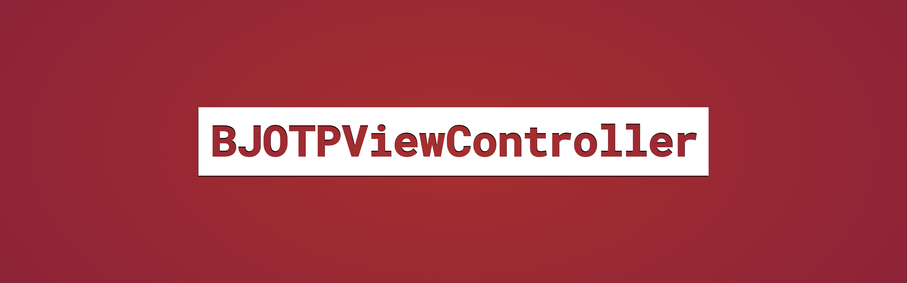
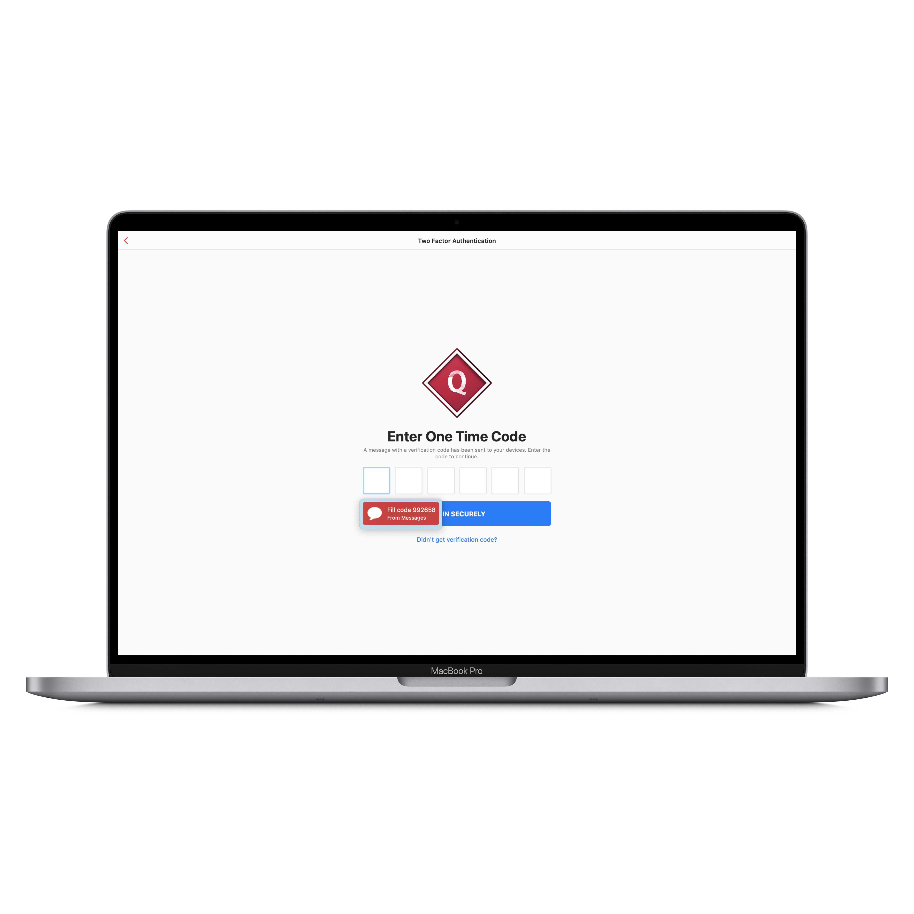

# BJOTPViewController




[](https://github.com/BadhanGanesh/BJOTPViewController/blob/master/LICENSE)

[](https://stackoverflow.com/users/5912335/badhanganesh?tab=profile)
[](https://twitter.com/intent/follow?screen_name=badhanganesh)


A very simple and neat-looking view controller that lets you type in OTPs quick and easy.


## Supports

✅ iOS 11.0+

✅ Swift 4.0+

✅ Portrait | Landscape

✅ Light Mode | Dark Mode

✅ iOS | iPadOS | macOS (Catalyst)

✅ Objective-C (Xcode 11.4 onwards)


## Features

✅ Keyboard handling

✅ Copy-Paste handling

✅ Auto-fill from Messages app

✅ Apple-inspired Clean User Interface

✅ Custom primay / secondary / footer labels

✅ Detection of copied text / code from outside the app


## Installation

1. In Xcode project, go to **File** → **Swift Packages** → **Add Package Dependency...**

2. Paste the repo URL: https://github.com/BadhanGanesh/BJOTPViewController.git

3. Follow onscreen instructions for choosing the package options and targets you want to add the dependency to - but make sure you always consider choosing the latest version for the best experience - and click **Finish** when you're done.


## Screenshots


-----



## Usage

**Presentation**

```swift
import BJOTPViewController

// Initialise view controller
let oneTimePasswordVC = BJOTPViewController.init(withHeading: "Two Factor Authentication",
                                                 withNumberOfCharacters: 6,
                                                 delegate: self)
// Present it
self.present(oneTimePasswordVC, animated: true, completion: nil)
```

**Delegate methods**

```swift
//Conform to BJOTPViewControllerDelegate

 func authenticate(_ otp: String, from viewController: BJOTPViewController) {
 
 /**
  * Use this delegate method to make API calls, show loading animation in `viewController`, do whatever you want.
  * You can dismiss (if presented) the `viewController` when you're done.
  *
  * This method will get called only after the validation is successful, i.e., after the user has filled all the text fields.
  *
  * - Parameter otp: The full otp string entered.
  * - Parameter viewController: The otp view controller.
  *
  * - Author: Badhan Ganesh
  */
 
 }

 func didClose(_ viewController: BJOTPViewController) {
 
 /**
  * This method will get called whenever the otp view controller is closed, either by popping, dismissing, or tapping the close button.
  *
  * Use this to invalidate any timers, do clean-ups, etc..
  *
  * - Parameter viewController: The otp view controller.
  *
  * - Author: Badhan Ganesh
  */
  
 }

 func didTap(footer button: UIButton, from viewController: BJOTPViewController) {
 
 /**
  * This delegate method will get called when the footer button at the bottom is tapped. Use this to resend one time code from the server
  *
  * This method will only be called when the `shouldFooterBehaveAsButton` is `true`.
  *
  * - Parameter button: The button that's tapped.
  * - Parameter viewController: The otp view controller. Use this to show loaders, spinners, present any other view controllers on top etc..
  *
  * - Author: Badhan Ganesh
  */
  
 }
```

**Visuals**

```swift
let oneTimePasswordVC = BJOTPViewController(withHeading: "One Time Password",
                                            withNumberOfCharacters: 6,
                                            delegate: self)
                                            
// Button title. Optional. Default is "AUTHENTICATE".
oneTimePasswordVC.authenticateButtonTitle = "VERIFY OTP"

// Sets the overall accent of the view controller. Optional. Default is system blue.
oneTimePasswordVC.accentColor = UIColor.systemRed

// Currently selected text field color. Optional. This takes precedence over the accent color.
oneTimePasswordVC.currentTextFieldColor = UIColor.systemOrange

// Button color. Optional. This takes precedence over the accent color.
oneTimePasswordVC.authenticateButtonColor = UIColor.systemGreen
```

**Other options**

```swift
/**
 * Setting this to true opens up the keyboard for the very first text field.
 *
 * Default is `false`. Consider the `hideLabelsWhenEditing` property when setting this one to `true`, because when the keyboard is open as soon as the view controller is presented/pushed, if `hideLabelsWhenEditing` is `true`, the labels will be hidden initially as a result, and the user won't even know that the labels exist. It will be a better user experience if the user sees the labels initially since it guides them what to do. Choose wisely.
 *
 * - Author: Badhan Ganesh
 */
@objc public var openKeyboadDuringStartup: Bool = false

/**
 * The title of the primary header which stays above the OTP textfields.
 *
 * This is optional. In case of nil, the label won't be constructed at all. So make sure to set a string, or leave it as it is (`nil`). Changing this value after presenting or pushing `BJOTPViewController` won't have an effect; the label won't be constructed.
 *
 * - Author: Badhan Ganesh
 */
@objc public var primaryHeaderTitle: String?

/**
 * The title of the secondary header which comes below the primary header.
 *
 * This is optional. In case of nil, the label won't be constructed at all. So make sure to set a string, or leave it as it is (`nil`). Changing this value after presenting or pushing `BJOTPViewController` won't have an effect; the label won't be constructed.
 *
 * - Author: Badhan Ganesh
 */
@objc public var secondaryHeaderTitle: String?

/**
 * The title of the footer label which comes below the authenticate button.
 *
 * This is optional. In case of nil, the label won't be constructed at all. So make sure to set a string, or leave it as it is (`nil`). Changing this value after presenting or pushing `BJOTPViewController` won't have an effect; the label won't be constructed.
 *
 * - Author: Badhan Ganesh
 */
@objc public var footerTitle: String?

/**
 * Set whether the primary, secondary, and footer labels are to be hidden during editing, i.e., when the keyboard is open.
 *
 * Default is `false`
 *
 * - Author: Badhan Ganesh
 */
@objc public var hideLabelsWhenEditing: Bool = false

/**
 * Setting this to `true` will show an alert to the user whenever a compatible text is copied to clipboard asking whether or not to paste the same. Yes or No option will be provided.
 *
 * Default is `true`.
 *
 * Tapping "Yes" will auto-fill all the textfields with copied text and will call the `authenticate` delegate method.
 *
 * Pop-up won't be shown for the same string copied over and over. Clipboard will be checked when the app comes to foreground, and when the view controller's view finished appearing.
 *
 * - Author: Badhan Ganesh
 */
@objc public var shouldPromptUserToPasteCopiedStringFromClipboard: Bool = true

/**
 * Setting this to `true` will automatically paste compatible text that is present in the clipboard and call the `authenticate` delegate method without asking any questions. This property will take precedence over `shouldPromptUserToPasteCopiedStringFromClipboard` property.
 *
 * Default is `false`.
 *
 * But be careful when setting this to `true` as this might not be the best user experiece all the time. This does not gives the user the control of what code to paste.
 *
 * Some/most users may prefer quick submission and verification of OTP code without any extra clicks or taps. This saves a quite a few milliseconds from them.
 *
 * **Note:** OTP code won't be pasted for the same string copied over and over. Clipboard will be checked when the app comes to foreground, and when the view controller's view finished appearing.
 *
 * - Author: Badhan Ganesh
 */
@objc public var shouldAutomaticallyPasteCopiedStringFromClipboard: Bool = false

/**
 * Uses haptics for touches, interactions, successes and errors within the OTP view controller.
 *
 * Default is `true`.
 *
 * - Author: Badhan Ganesh
 */
@objc public var hapticsEnabled: Bool = true

/**
 * Asks whether the footer should behave as a button or just a normal label. Button will pass the action to the delegate method `didTap(footer button: UIButton)`.
 *
 * If `true`, the color of the footer will be `.systemBlue`, and gray otherwise. Default is `false`.
 *
 * - Author: Badhan Ganesh
 */
@objc public var shouldFooterBehaveAsButton: Bool = false

/**
 * The color of the footer.
 *
 * This color will be applied only when `shouldFooterBehaveAsButton` is set to `true`. Default gray color will be used otherwise. Default color is `.systemBlue`.
 *
 * - Author: Badhan Ganesh
 */
@objc public var footerButtonColor: UIColor?
```


## Contribution

- Pull Requests are always welcome. Would love to see your inputs.


## License

This code is distributed under the terms and conditions of the [MIT license](LICENSE).
