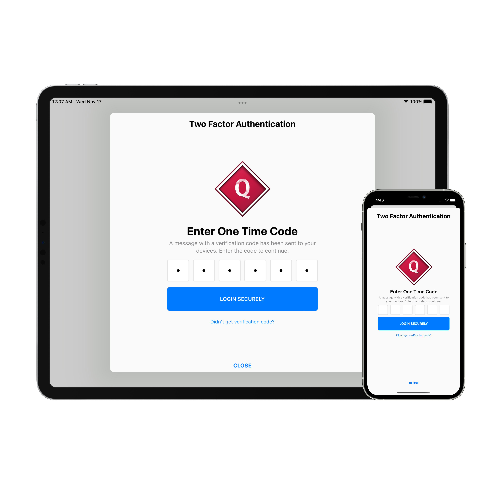

# BJOTPViewController

A very simple and neat-looking view controller that lets you type in OTPs quick and easy. 
Check out the <a href="https://badhanganesh.github.io/BJOTPViewController/documentation/bjotpviewcontroller/" target="_blank">Developer Documentation</a> for more detailed usage information.

-----

## License

This code is distributed under the terms and conditions of the [MIT license](LICENSE).
